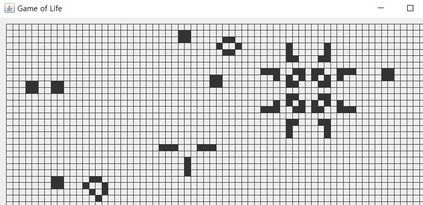
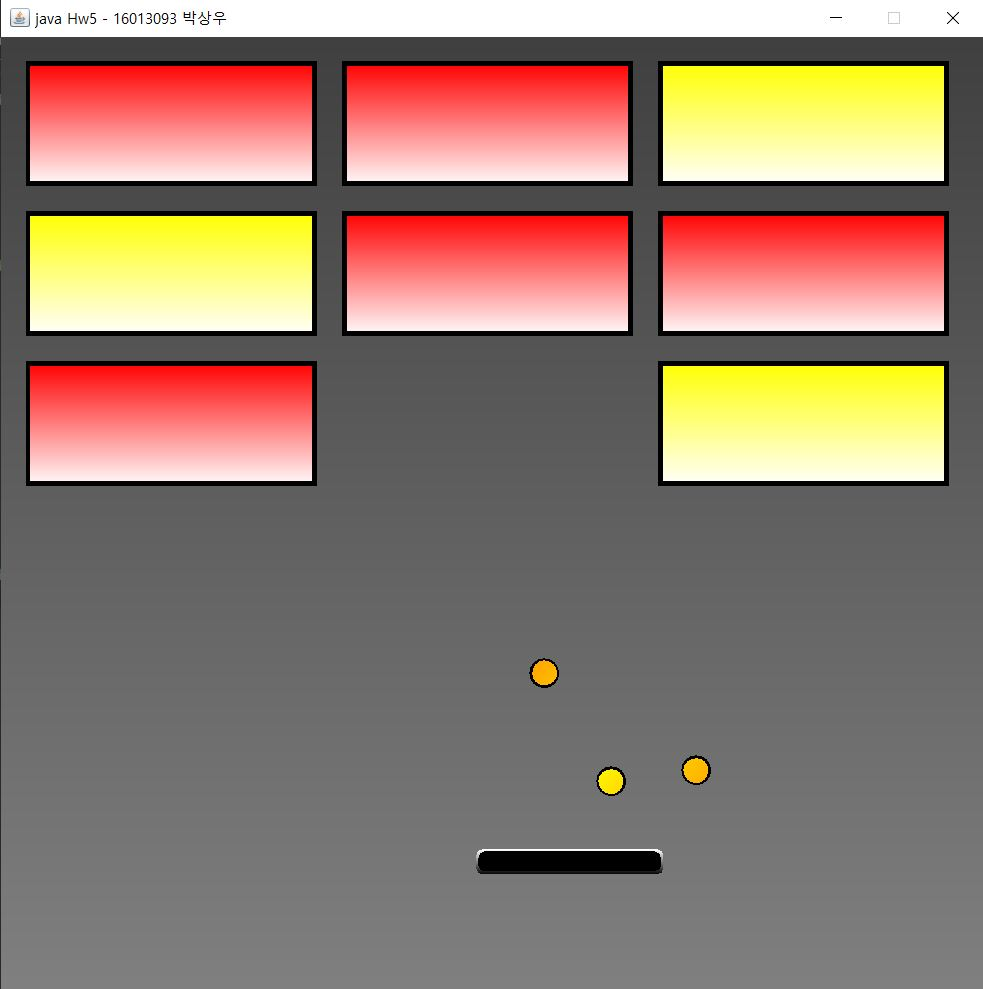

# java 기초
    - 클래스
    - 인터페이스
    - 상속, 다형성
    - 콜렉션
    - swing
  
# swing 응용 프로그램
    - 점그리기
    - 선그리기
    - 사각형 그리기, 색바꾸기
    - 원 그리기
    - 리스트에 원 정보 표시 및 삭제
    - 타이핑
    - 디지털 시계
    - 원형 시계
    - 마우스 추적
    - 그림 확대
    - 애니메이션

# 응용 프로그램
    - game of life
  
  
    - 벽돌 깨기
  
